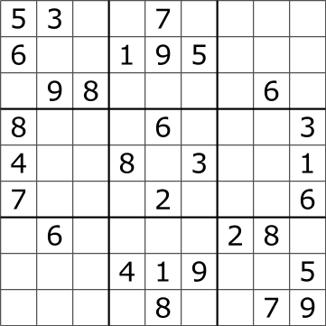
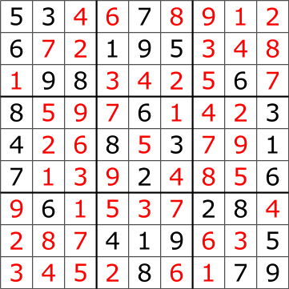

# ParaSudoku
Maitreyee Joshi(maitreyj@andrew.cmu.edu), Tingyu Bi(tbi@andrew.cmu.edu)

## Reader's Note

On Saturday, May 6th, we changed our project from ScanNet: Video Analysis on MXNet to ParaSudoku. We were facing several issues configuring, understanding, and defining our evaluation criteria for both MXNet and Scanner. Due to the time constraints that we were facing, we decided to refocus our efforts on parallelizing algorithms that we could code from scratch. The proposal and checkpoint for our previous project are located [here](https://sophie4869.github.io/ScanNet/).

## Summary

We implemented two sequential and three parallel sudoku solvers. We used a brute-force, backtracking algorithm and Crook's Algorithm to implement the two sequential sudoku solvers. We then parallelized the brute-force backtracking algorithm using Cuda and running multiple threads on the GPU. We parallelized Crook's Algorithm in two ways: 

## Background

Sudoku is traditionally played on a 9x9 board. These 81 cells on the board are broken down into 9 3x3 subboxes. The goal of the game is to place the numbers 1-9 into the cells such that no other cells in the same row, column, or box contain the same number.

Below are examples of a sudoku puzzle (top) and its solution (bottom):

### Challenges

There are several challenges associated with solving sudoku puzzles in parallel. Solving sudoku puzzles is an NP-complete problem, with ove 6.67 x 10^21 distinct solutions for the 9x9 board, thus making Sudoku a complex problem to solve. Furthermore, each cell depends on the corresponding values in its row, column, and subbox. Since each cell is dependent on so many other cells, there is no straightforward to parallelize solving Sudoku.

### Sequential Algorithms

Within our project, we implemented two sequential algorithms for our baseline: a brute-force, backtracking algorithm and Crook's algorithm.

#### Brute-Force Algorithm

## Approaches

## Results

## References
