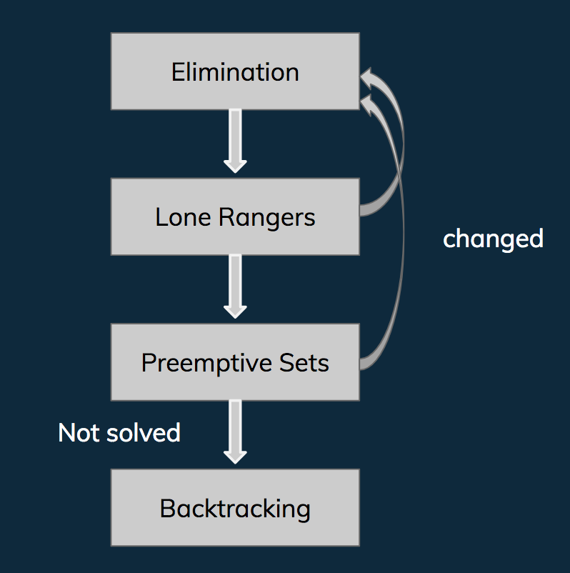
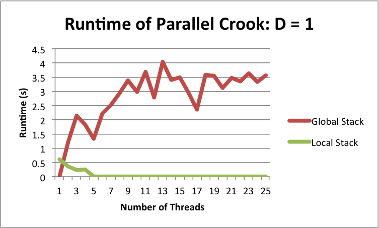
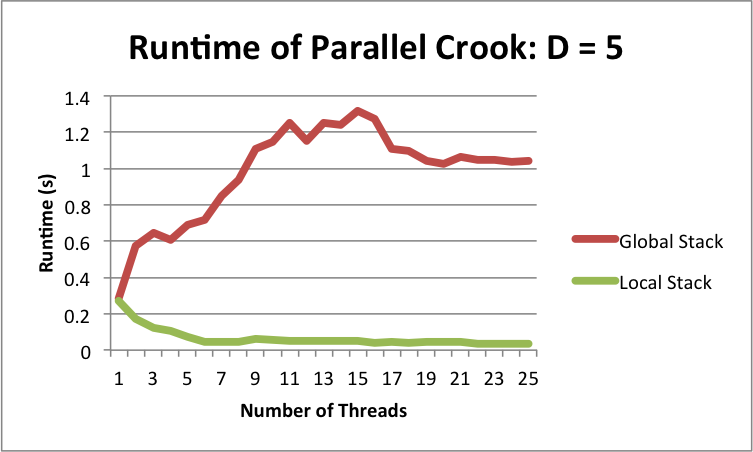
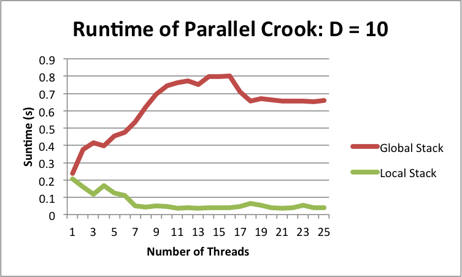
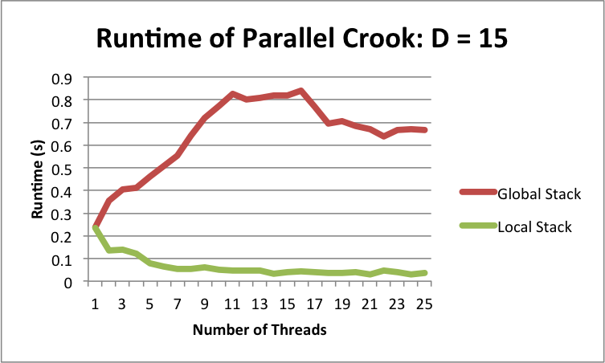
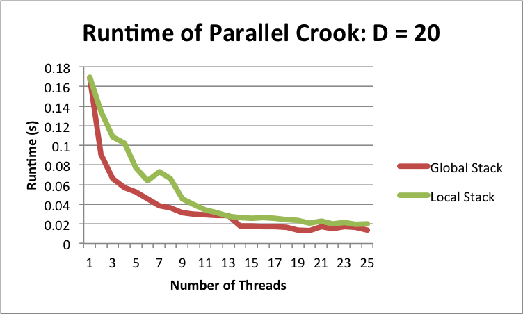
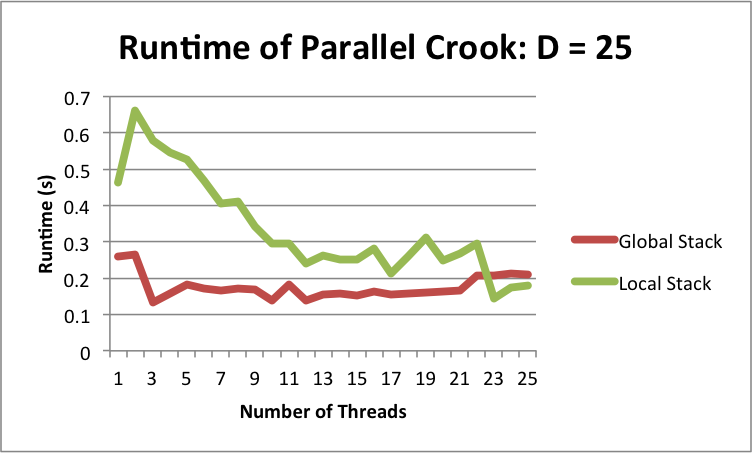

# ParaSudoku
Maitreyee Joshi(maitreyj@andrew.cmu.edu), Tingyu Bi(tbi@andrew.cmu.edu)

## Reader's Note

On Saturday, May 6th, we changed our project from ScanNet: Video Analysis on MXNet to ParaSudoku. We were facing several issues configuring, understanding, and defining our evaluation criteria for both MXNet and Scanner. Due to the time constraints that we were facing, we decided to refocus our efforts on parallelizing algorithms that we could code from scratch. The proposal and checkpoint for our previous project are located [here](https://sophie4869.github.io/ScanNet/).

## Summary

We implemented two sequential and three parallel sudoku solvers. We used a brute-force, backtracking algorithm and Crook's Algorithm to implement the two sequential sudoku solvers. We then parallelized the brute-force backtracking algorithm using Cuda and running multiple threads on the GPU. We parallelized Crook's Algorithm in two ways: 

## Background

Sudoku is traditionally played on a 9x9 board. These 81 cells on the board are broken down into 9 3x3 subboxes. The goal of the game is to place the numbers 1-9 into the cells such that no other cells in the same row, column, or box contain the same number.

Below are examples of a sudoku puzzle (top) and its solution (bottom):


### Challenges

There are several challenges associated with solving sudoku puzzles in parallel. Solving sudoku puzzles is an NP-complete problem, with ove 6.67 x 10^21 distinct solutions for the 9x9 board, thus making Sudoku a complex problem to solve. Furthermore, each cell depends on the corresponding values in its row, column, and subbox. Since each cell is dependent on so many other cells, there is no straightforward to parallelize solving Sudoku.

### Sequential Algorithms

Within our project, we implemented two sequential algorithms for our baseline: a brute-force, backtracking algorithm and Crook's algorithm.

#### Backtracking Algorithm
We implemented the following steps in our algorithm:
```
Choose starting point
While (problem not solved):
	For each path from starting point:
		If selected path has no conflicts:
			Select path and make recursive call to rest of problem
			If (recursive problem returns true):
				Return true
			Else:
				Return false
```

#### Crook's Algorithm
Crook's algorithm describes the following few methods to determinisically solve cells in sudoku puzzles. We used the following three methods in our implementation: 
1. *Elimination*: A cell has only one value left.
2. *Lone Ranger*: In a row, column, or block, a value fits into only one cell.
3. *Preemptive Set*: In a row, column, or block, a set of m values are contained within m cells.

## Approaches

### Parallelized Crook's Algorithm

Our implementation of Crook's Algorithm tries each of the aforementioned methods in order. If any method makes a change to the board, the solver starts over again from the elimination phase. If none of these three methods work, the algorithm resorts to backtracking to solve the rest of the puzzle. The following chart visualizes this process: 



After developing and running Crook's algorithm, we noticed that the most time-intensive part of the algorithm was the backtracking portion. The backtracking portion took about 100 times longer to run than the elimination, longer ranger, and preemptive set methods took, thus slowing down the entire Crook's Algorithm. In order to make the backtracking portion more efficient, we parallelized the backtracking section in two different ways:

#### Version 1: Global Stack

In the first version, the parallelized portion of the backtracking portion works as follows:

1. Create X threads and send each thread a different starting board and a common global stack.
2. Each of the X threads should then:
    1. Fill in D spots of board.
    2. Push back all valid boards to the global stack.
    3. Pull another board and repeat the process of filling in the next D spots.
    
We played around with the values X (the number of threads) and D (the number of spots that a thread would fill before pushing the valid boards back to the stack) to determine the optimal values. 

We played around with the value of D instead of simply setting D = 1 in order to reduce contention. If we pushed and popped from the global stack every time a thread filled in a new spot on the board, all the threads would be doing very little work and would be contending for the lock on the global stack often. This, in turn, would cause a major downturn in performance. 

Based on our hypothesis that the threads would be contending for the locks on the global stack often, we decided to implement a second version of a parallelized backtracking portion in Crook's Algorithm.

#### Version 2: Local Stack

In the second version, we had each thread push and pull boards from its own local stack instead of the common global stack. The parallelized portion of the backtracking portion works as follows:

1. Create X threads and send each thread a different starting board and a local stack.
2. Each of the X threads should then:
    1. Fill in D spots of board.
    2. Push back all valid boards to its local stack.
    3. Pull another board and repeat the process of filling in the next D spots.
    
Since each thread was pushing and pulling from its own stack, there was no contention between threads since they weren't modifying any common resource. One potential drawback of this method was the work imbalance problem: one thread could be stuck with a lot of work in its own stack while the other threads were waiting idly since they had finished all of their work in their respective stacks. This potential issue could have been solved by implementing work stealing but we were unfortunately unable to implement this due to time constraints.

### Cuda Sudoku Solver

## Results

### Parallelized Crook's Algorithm

We measured speedup on expert-level 9x9 suddoku boards. We evaluated the performances of the two versions of the parallelized Crook's algorithm by measuring their respective runtimes as we varied the values of X (the number of threads) and D (the number of spots that a thread would fill before pushing the valid boards back to the stack). We varied the value of X used by the solver from 1 to 25. We measured the impact of changing D at 4 different values: 1, 5, 10, 15, 20, and 25. 

Here are the results:













These results indicate that many of our hypothesis were correct:

1) Looking at the chart for D = 1, the runtime of the algorithm with the global stack is significantly slower than the runtime of the algorithm with the local stack. The runtime of the global stack algorithm increases as the number of threads increase. We believe that this is due to contention. Since the threads are constantly popping and pushing boards after doing extremely minimal work (only filling in one cell), the increased number of threads in the global stack algorithm leads to increased contention and thus increased runtime. The local stack algorithm doesn't have this problem since it is modifying its own stack.

2) The charts of D at 5, 10, and 15 further confirm this hypothesis that the global stack algorithm is facing issues with runtime and thus has longer runtimes. In each of these graphs, the global stack algorithm is still slower than the local stack algorithm but differences in runtime between them are narrowing. We suspect that since the work that each thread does in between pushing and popping from the global stack is increasing, the contention in between threads to modify the global stack is decreasing. Thus, there is a corresponding decrease in runtime for the global stack algorithm.

3) When D = 20, the performances of the global stack algorithm and local stack algorithm are roughly equal. Furthermore, the runtime of the global stack algorithm actually decreases now with the increase in the number of threads used. We believe that this is because there is significant enough work for each thread to do that its beneficial for this work to be split up and there are fewer times that each thread is trying to access the global stack.

4) When D = 25, the global stack algorithm performs better than the local stack algorithm. We suspect that this is due to the work imbalance problem that the local stack algorithm faces, where one thread is doing all the work while others are waiting idly by. This problem could be mitigated by work stealing.

### Cuda Sudoku Solver


## References
